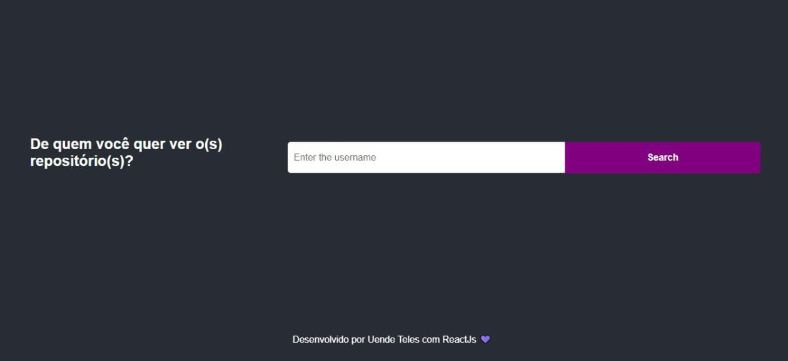
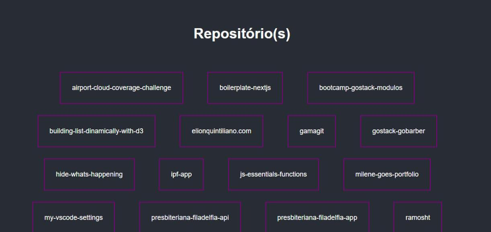

# Searching github user repositories 🔍

This is a project developed by Uende Teles in the FullStack training of the Hiring Coders program, through the classes of Professor Guilherme Ramos. 👩🏾‍💻😃

## Access in https://user-repositories.vercel.app/

## Tech 💻

- ReactJs 💜
- Axios 💜
- Styled Components 💜

## Application demo ✔️ 

